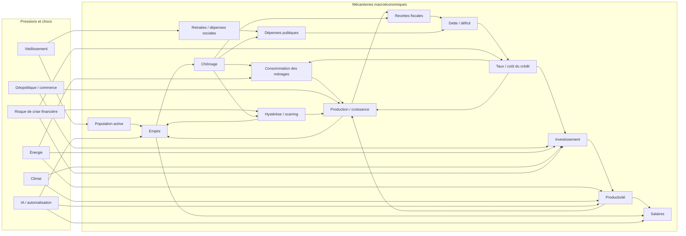
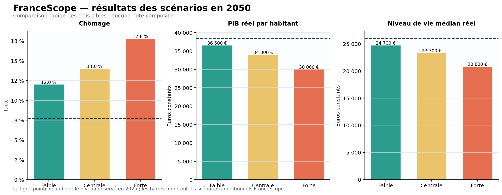
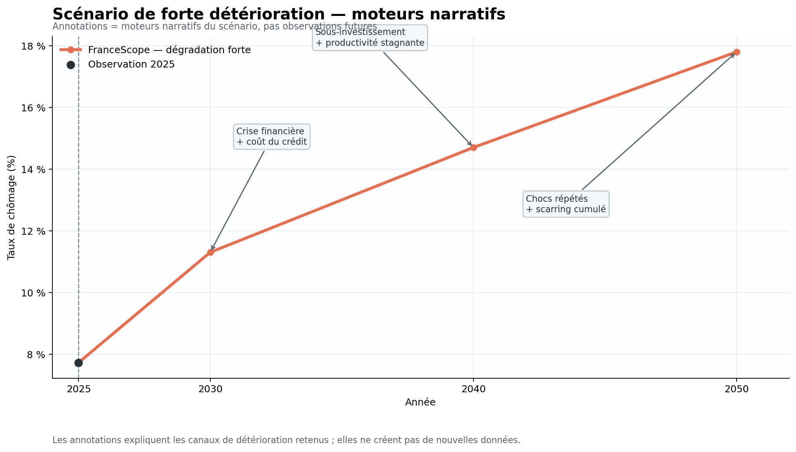
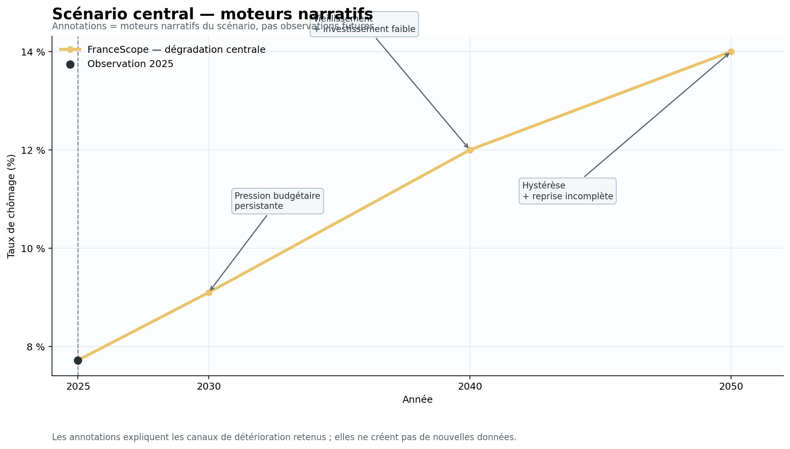
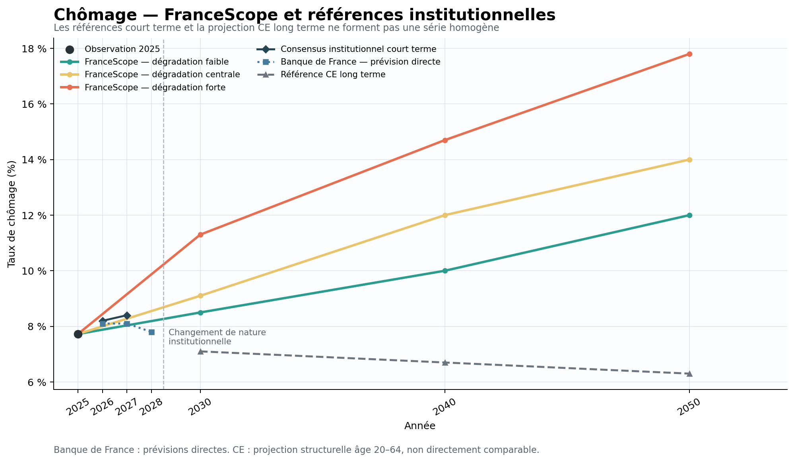

# FranceScope AI — Documentation principale

## 1. Vue d’ensemble

FranceScope AI étudie une question volontairement difficile : **compte tenu
des contraintes structurelles de la France et de chocs futurs plausibles,
comment l’emploi, la production par personne et le niveau de vie médian
pourraient-ils évoluer jusqu’en 2050 ?**

Le projet a commencé comme un simulateur causal macroéconomique très large.
L’ambition initiale était de représenter de nombreuses interactions entre
demande, investissement, productivité, emploi, finances publiques, démographie,
énergie, climat, commerce et conditions de vie.

Cette architecture rendait les mécanismes visibles, mais chaque variable
intermédiaire ajoutait une définition, une hypothèse, un horizon et une
validation à maintenir. L’incertitude cumulative et les risques de double
comptage rendaient les résultats difficiles à défendre. La V8 a donc réduit la
surface numérique du modèle : seules trois cibles finales sont prédites
quantitativement ; le reste sert de structure causale et d’évidence pour les
scénarios.

FranceScope est à la fois :

- un projet de prévision macroéconomique conditionnelle ;
- un cas d’étude d’**LLM Engineering** et de **Context Engineering**.

La simplification n’a pas supprimé le raisonnement économique. Elle a séparé
les mécanismes utiles à l’analyse des valeurs qui peuvent être présentées comme
des prévisions finales.

## 2. Les trois variables finales

| Variable | Ce qu’elle représente | Pourquoi elle est conservée |
|---|---|---|
| **Chômage** | Accès à l’emploi, sécurité économique et santé du marché du travail | Rend visibles les crises répétées, l’hystérèse et la persistance des chocs |
| **PIB réel par habitant** | Production et capacité productive moyenne par personne | Mesure la capacité économique agrégée sans confondre croissance et distribution |
| **Niveau de vie médian réel** | Situation matérielle de la personne ou du ménage médian après impôts et transferts | Représente mieux la distribution vécue qu’une moyenne agrégée seule |

Ensemble, ces cibles couvrent **emploi, production et niveau de vie distribué**.
Elles évitent de transformer des variables hétérogènes en un indice composite
dont la normalisation et les pondérations auraient ajouté une précision
artificielle.

FranceScope ne prétend pas résumer toute la qualité de vie française. Les
services publics, la santé, le patrimoine, l’environnement, les loisirs, la
sécurité et les inégalités au-delà de la médiane ne sont pas directement
inclus dans les trois cibles.

## 3. Ce que le projet cherche à montrer

Le projet ne prétend pas prédire chaque aspect du bien-être ni produire une
prophétie pour 2050. Il construit des trajectoires conditionnelles et
traçables : si certaines contraintes persistent et si certains chocs se
répètent, quelles conséquences plausibles apparaissent pour les trois résultats
finaux ?

La trajectoire « contenue » n’est donc pas une trajectoire de prospérité. Elle
est le résultat le moins défavorable dans un cadre où vieillissement, pression
budgétaire, sous-investissement et scarring restent importants.

## 4. Théorie macroéconomique centrale

Les trois scénarios partagent un socle de détérioration structurelle. Les
différences portent surtout sur le calendrier, la sévérité et la durée des
chocs, la qualité de la reprise, le scarring cumulé et la force des facteurs
compensateurs.

### Pressions structurelles

- déficits persistants, dette et charge du service de la dette ;
- taux d’intérêt et coût du crédit ;
- investissement et formation de capital faibles ;
- productivité insuffisante et contraintes de compétitivité ;
- vieillissement, retraites et pression sur les dépenses sociales ;
- contraintes sur la population active ;
- désindustrialisation, énergie et dommages climatiques ;
- chocs géopolitiques, fragmentation commerciale et risque financier ;
- récessions répétées, hystérèse du chômage et reprises incomplètes ;
- contraintes politiques et confiance limitée dans un retour complet à la
  moyenne.

### Facteurs compensateurs

Les gains de productivité liés à l’IA, l’automatisation, l’innovation, une
reprise de l’investissement, la transition énergétique ou une capacité de
réforme peuvent améliorer la trajectoire. Dans le cadre FranceScope, ils ne
dominent pas automatiquement les contraintes persistantes : leur diffusion,
leur calendrier et leurs effets distributifs restent incertains.

## 5. Variables prévues et variables causales

### Variables prévues numériquement

- chômage ;
- PIB réel par habitant ;
- niveau de vie médian réel.

### Variables causales ou explicatives

La construction des scénarios mobilise notamment la consommation des ménages,
l’investissement, la productivité, les salaires, l’emploi, les recettes
fiscales, les dépenses publiques, la dette, le déficit, les taux et conditions
de crédit, la démographie, les retraites, l’énergie, le climat, la géopolitique,
le commerce, l’IA, l’automatisation, les crises financières, la confiance et
le scarring.

Ces variables structurent les canaux de transmission et les tests de
cohérence. Elles ne sont pas toutes présentées comme des forecasts numériques
autonomes dans le résultat V8.

## 6. Diagramme causal

Le diagramme montre des canaux de transmission, pas une équation unique ni une
simulation supplémentaire.



Quelques chaînes importantes sont explicites : une croissance plus faible
réduit les recettes ; le chômage augmente les dépenses et réduit les recettes ;
les déficits augmentent la dette ; la dette peut accroître le coût du
financement ; ce coût affaiblit l’investissement et la croissance. Le
vieillissement pèse simultanément sur les dépenses et la population active.
L’IA peut soutenir la productivité tout en perturbant l’emploi, tandis que les
crises financières peuvent laisser une cicatrice persistante.

## 7. Logique des scénarios

| Scénario | Interprétation |
|---|---|
| **Dégradation contenue / least-bad** | Chocs plus tardifs ou mieux absorbés, reprises plus solides, mais contraintes structurelles toujours présentes |
| **Détérioration centrale** | Combinaison intermédiaire de pression budgétaire, sous-investissement, chocs et reprises incomplètes |
| **Forte détérioration** | Chocs plus sévères ou rapprochés, scarring élevé et faible capacité de récupération |

« Optimiste » ne signifie donc pas prospérité : cela signifie le résultat le
moins défavorable à l’intérieur du cadre structurel FranceScope.

## 8. Données et méthode de prévision

La chaîne de travail combine :

1. construction d’un ancrage historique ;
2. sélection de sources institutionnelles et enregistrement de leur provenance ;
3. séparation des observations, forecasts directs, projections de long terme,
   hypothèses structurelles et proxies dérivés ;
4. construction des scénarios et collecte d’éléments de preuve ;
5. contrôles d’intégrité des unités, années, définitions et statuts ;
6. tests de cohérence temporelle et de cohérence entre variables ;
7. revue multi-modèles et validation humaine ;
8. gel des valeurs finales.

Une absence de donnée est conservée comme `NA` lorsqu’aucune valeur directement
comparable n’est défendable. **NA > fausse précision.**

### Gates d’évaluation

Une sortie n’est pas acceptée parce qu’elle semble plausible. Elle doit passer
des contrôles successifs :

```text
Intégrité des données
        ↓
Cohérence temporelle
        ↓
Cohérence entre variables
        ↓
Ordre des scénarios
        ↓
Plausibilité historique
        ↓
Provenance et cohérence des sources
        ↓
Revue adversariale multi-modèles
        ↓
Gel, rejet ou révision justifiée
```

Les contrôles portent notamment sur la variable, l’année, le scénario, l’unité,
le réel contre le nominal, le pourcentage contre le décimal, le statut
observation/prévision et l’horizon de la source.

Les valeurs finales publiques sont conservées dans
[final_three_target_forecasts.csv](../data/final/final_three_target_forecasts.csv).
Le registre des sources institutionnelles est disponible dans
[institutional_source_registry.csv](../data/institutional/institutional_source_registry.csv).

## 9. Résultats finaux

| Scénario | Année | Chômage | PIB réel / hab. | Niveau de vie médian réel |
|---|---:|---:|---:|---:|
| Ancrage observé | 2025 | 7,725 % | 38 360 € | 25 952,51 € |
| Dégradation contenue | 2030 | 8,5 % | 39 700 € | 26 500 € |
| Dégradation contenue | 2040 | 10,0 % | 39 000 € | 25 800 € |
| Dégradation contenue | 2050 | 12,0 % | 36 500 € | 24 700 € |
| Centrale | 2030 | 9,1 % | 38 500 € | 25 800 € |
| Centrale | 2040 | 12,0 % | 36 500 € | 25 000 € |
| Centrale | 2050 | 14,0 % | 34 000 € | 23 300 € |
| Forte détérioration | 2030 | 11,3 % | 37 000 € | 25 000 € |
| Forte détérioration | 2040 | 14,7 % | 34 000 € | 23 100 € |
| Forte détérioration | 2050 | 17,8 % | 30 000 € | 20 800 € |



## Visualisations long terme

### Chômage (2010–2050)


Les points noirs représentent les observations publiques disponibles. Les
scénarios FranceScope prolongent l’ancrage 2025 jusqu’en 2050. Les repères
institutionnels sont volontairement discontinus : consensus court terme,
prévision directe de la Banque de France et projection structurelle CE ne sont
pas une série homogène.

### PIB réel par habitant (2010–2050)


Les observations historiques disponibles sont affichées comme points, sans
inventer une série annuelle. Aucun niveau institutionnel de long terme n’est
tracé : les jalons institutionnels de croissance ne sont pas convertis
mécaniquement en euros par personne.

### Niveau de vie médian réel (2010–2050)


Le graphique montre l’ancrage historique disponible et les trois trajectoires
conditionnelles. Aucune prévision institutionnelle de long terme comparable
n’est disponible ; elle reste `NA`.

### Pourquoi le scénario de forte détérioration se dégrade



Les annotations sont des moteurs narratifs du scénario, pas des observations
futures. Elles illustrent une chaîne de chocs financiers, de coût du crédit,
de sous-investissement, de productivité faible, de chocs répétés et de
scarring cumulé.

### Pourquoi le scénario central se dégrade



Le scénario central utilise moins de chocs extrêmes, mais conserve une pression
budgétaire persistante, le vieillissement, un investissement insuffisant et une
reprise incomplète.

## 10. Comparaison institutionnelle

Le benchmark n’est pas un consensus institutionnel homogène jusqu’en 2050. Il
combine plusieurs statuts :

- consensus de court terme lorsque plusieurs références comparables existent ;
- prévisions directes d’une institution pour un horizon donné ;
- projections structurelles de long terme ;
- hypothèses ou proxies qui ne doivent pas être présentés comme des forecasts
  officiels.

Pour le chômage, les repères publics retenus sont un consensus de **8,2 % en
2026**, **8,4 % en 2027**, la Banque de France à **7,8 % en 2028**, puis la
référence structurelle de la Commission européenne à **7,1 % en 2030**,
**6,7 % en 2040** et **6,3 % en 2050**.

Il n’existe pas de niveau institutionnel GDPpc en euros directement comparable
jusqu’en 2050 ni de prévision institutionnelle directe de long terme du niveau
de vie médian. Les valeurs manquantes restent `NA`.

FranceScope diverge parce qu’il s’agit d’un cadre conditionnel adverse, avec un
horizon plus long et un poids plus élevé donné à la pression budgétaire, à la
charge de la dette, à la faiblesse de la formation de capital et de la
productivité, à la démographie, aux contraintes politiques, aux chocs répétés,
à l’hystérèse et au scarring cumulé. Les projections institutionnelles sont
souvent des références de base, pas des scénarios conditionnels de détérioration
persistante.



## 11. Limites

L’incertitude augmente avec l’horizon, particulièrement vers 2050. Les
trajectoires sont des scénarios conditionnels et non des prophéties, des
intervalles probabilistes calibrés ou des prévisions institutionnelles.

La couverture institutionnelle est hétérogène : certaines références concernent
le chômage à court terme ou en projection structurelle, tandis que des niveaux
directement comparables de PIB réel par habitant et de niveau de vie médian ne
sont pas disponibles jusqu’en 2050. Les absences restent `NA`.

Le projet ne représente pas toute l’économie française ni toute la qualité de
vie. Les dimensions non prévues directement sont décrites dans la section sur
les trois cibles.

## 12. LLM Engineering et Context Engineering

Le projet est devenu un cas d’étude de contrôle de LLM puissants mais
imparfaits. Les pratiques centrales sont :

- scope explicite, fichiers autoritatifs et décisions gelées ;
- recherche bornée, lectures ciblées et minimisation des tokens ;
- conditions d’arrêt et règles anti-boucle ;
- gestion d’état et handoffs reproductibles ;
- plus petites modifications sûres ;
- validation des données avant acceptation ;
- cohérence temporelle et cross-variable ;
- provenance des sources et taxonomie des statuts ;
- revue adversariale multi-modèles ;
- décisions finales human-in-the-loop.

**Le prompt est une partie du système, pas le système entier.** La qualité du
contexte est aussi une question de provenance, d’état, de permissions et de
critères d’acceptation.

### Revue multi-modèles

Les autres modèles sont des générateurs d’hypothèses adversariales, pas des
arbitres qui votent :

```text
Résultat candidat
      ↓
Critique externe
      ↓
Hypothèse testable
      ↓
Reproduction / vérification
      ↓
Révision uniquement si justifiée
```

### Échecs instructifs et leçons

Les principales difficultés ont été la dérive du périmètre, les boucles de
recherche, la perte d’état, la surédition, la confusion entre forecast et
projection, et les sorties localement plausibles mais globalement
incohérentes. Elles ont conduit à des règles de scope, des décisions gelées,
des lectures ciblées, des conditions d’arrêt, une taxonomie des sources et des
évaluations temporelles et cross-variable.

La leçon centrale est que la provenance compte autant que l’arithmétique :
une transformation correcte peut rester invalide si la définition, l’horizon
ou le statut de la source ne correspondent pas à la valeur affichée.

## 13. Mon rôle

J’ai défini l’objectif de prévision, l’architecture, le cadre des scénarios et
les trois cibles finales. J’ai créé les règles de context engineering, imposé
le périmètre et les conditions d’arrêt, sélectionné les éléments de preuve,
détecté les incohérences et utilisé plusieurs LLM pour la critique.

J’ai décidé quelles révisions étaient justifiées, gelé les valeurs finales et
simplifié l’architecture lorsque la complexité devenait contre-productive. Les
LLM ont accéléré la recherche, l’analyse, le code et la documentation ; la
responsabilité du jugement final est restée humaine.

**Human-directed, machine-accelerated.**

## 14. Pour approfondir

- [Évolution du projet](project_evolution.md)
- [Rapport technique V8](technical_report.md)
- [Méthodologie du benchmark institutionnel](institutional_benchmark_methodology.md)
- [Workflow LLM fiable](reliable_llm_workflows.md)
- [Cadre d’évaluation](evaluation_framework.md)
- [Échecs utiles et leçons](failures_and_lessons.md)
