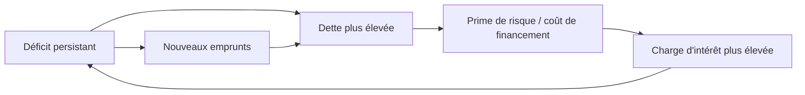
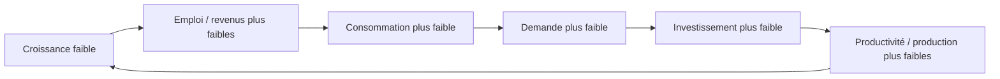
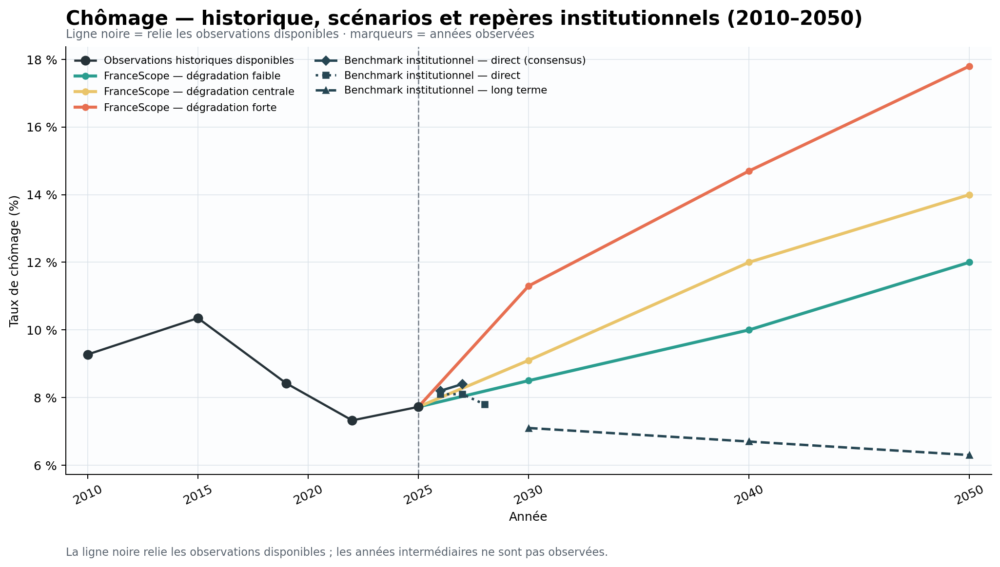
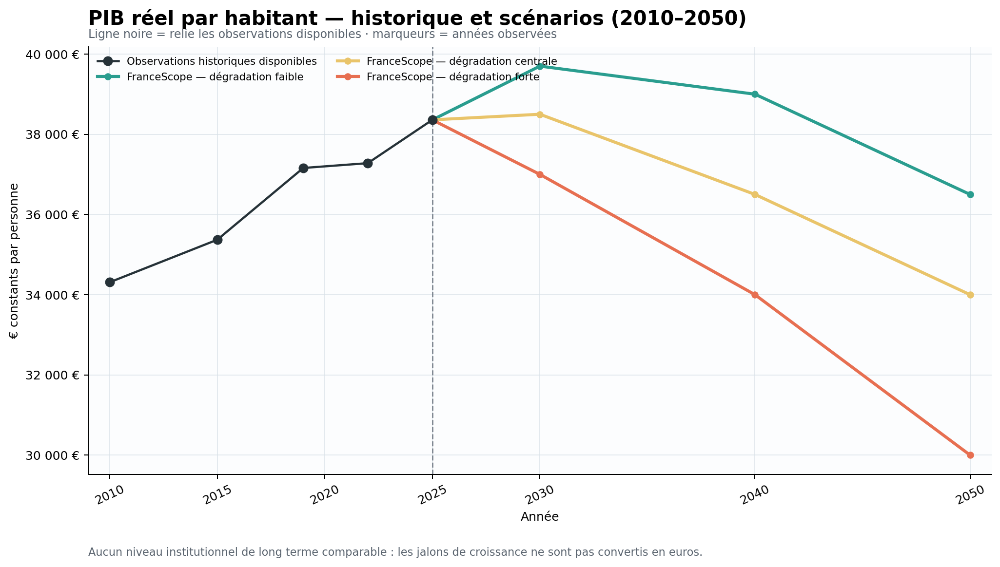
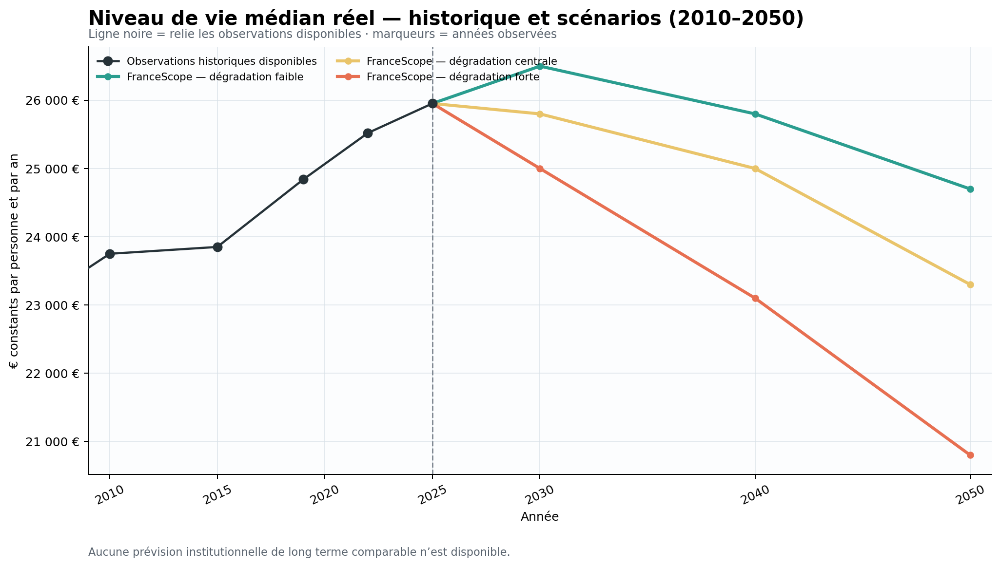

# FranceScope AI — Documentation principale

## 1. Vue d’ensemble

FranceScope AI étudie une question volontairement difficile : **compte tenu
des contraintes structurelles de la France et de chocs futurs plausibles,
comment l’emploi, la production par personne et le niveau de vie médian
pourraient-ils évoluer jusqu’en 2050 ?**

Le projet a commencé comme un simulateur causal macroéconomique très large.
L’ambition initiale était de représenter de nombreuses interactions entre
demande, investissement, productivité, emploi, finances publiques, démographie,
énergie, climat, commerce et conditions de vie.

Cette architecture rendait les mécanismes visibles, mais chaque variable
intermédiaire ajoutait une définition, une hypothèse, un horizon et une
validation à maintenir. L’incertitude cumulative et les risques de double
comptage rendaient les résultats difficiles à défendre. La V8 a donc réduit la
surface numérique du modèle : seules trois cibles finales sont prédites
quantitativement ; le reste sert de structure causale et d’évidence pour les
scénarios.

FranceScope est à la fois :

- un projet de prévision macroéconomique conditionnelle ;
- un cas d’étude d’**LLM Engineering** et de **Context Engineering**.

La simplification n’a pas supprimé le raisonnement économique. Elle a séparé
les mécanismes utiles à l’analyse des valeurs qui peuvent être présentées comme
des prévisions finales.

## 2. Les trois variables finales

| Variable | Ce qu’elle représente | Pourquoi elle est conservée |
|---|---|---|
| **Chômage** | Accès à l’emploi, sécurité économique et santé du marché du travail | Rend visibles les crises répétées, l’hystérèse et la persistance des chocs |
| **PIB réel par habitant** | Production et capacité productive moyenne par personne | Mesure la capacité économique agrégée sans confondre croissance et distribution |
| **Niveau de vie médian réel** | Situation matérielle de la personne ou du ménage médian après impôts et transferts | Représente mieux la distribution vécue qu’une moyenne agrégée seule |

Ensemble, ces cibles couvrent **emploi, production et niveau de vie distribué**.
Elles évitent de transformer des variables hétérogènes en un indice composite
dont la normalisation et les pondérations auraient ajouté une précision
artificielle.

FranceScope ne prétend pas résumer toute la qualité de vie française. Les
services publics, la santé, le patrimoine, l’environnement, les loisirs, la
sécurité et les inégalités au-delà de la médiane ne sont pas directement
inclus dans les trois cibles.

## 3. Ce que le projet cherche à montrer

Le projet ne prétend pas prédire chaque aspect du bien-être ni produire une
prophétie pour 2050. Il construit des trajectoires conditionnelles et
traçables : si certaines contraintes persistent et si certains chocs se
répètent, quelles conséquences plausibles apparaissent pour les trois résultats
finaux ?

La trajectoire « contenue » n’est donc pas une trajectoire de prospérité. Elle
est le résultat le moins défavorable dans un cadre où vieillissement, pression
budgétaire, sous-investissement et scarring restent importants.

## 4. Théorie macroéconomique centrale

FranceScope ne se limite pas à choisir une hypothèse de croissance plus basse
qu’un benchmark institutionnel. Sa thèse est que des fragilités structurelles,
des boucles de rétroaction et des chocs répétés peuvent modifier la dynamique
de long terme elle-même.

Les prévisions macroéconomiques de référence restent utiles, mais les
prévisions ponctuelles et les trajectoires centrales comportent une
incertitude irréductible. L’inflation, le chômage, la croissance, les taux,
les récessions et les points de retournement ont régulièrement fait l’objet
d’erreurs de prévision, en particulier dans un environnement de rupture
technologique, de tensions géopolitiques, de risque climatique, de chocs
énergétiques, d’instabilité financière et de vieillissement.

FranceScope retient donc une autre pondération : il accorde davantage de poids
à l’accumulation des contraintes françaises, à leur interaction et aux
dommages persistants après choc. Il ne pose pas une crise souveraine ou
financière comme inévitable ; il examine comment le système devient plus
fragile lorsque plusieurs mécanismes se renforcent.

### Pressions structurelles

- déficits persistants, dette élevée et charge du service de la dette ;
- prélèvements obligatoires élevés et dépenses rigides, qui réduisent l’espace
  disponible pour l’investissement productif ;
- déficit extérieur, désindustrialisation, compétitivité fragile et
  productivité insuffisante ;
- investissement et formation de capital faibles, avec une croissance
  potentielle contrainte ;
- vieillissement, retraites, baisse de la population active et pression sur les
  dépenses sociales ;
- dépendance énergétique, transition coûteuse, dommages climatiques et
  fragmentation géopolitique ;
- concurrence technologique et difficulté à développer, diffuser, monétiser et
  capter localement les gains de l’IA ;
- contraintes politiques et sociales qui peuvent ralentir l’ajustement ;
- récessions répétées, hystérèse du chômage et pertes de capital humain.

Ces facteurs ne sont pas seulement additifs. Une croissance faible réduit les
recettes, limite l’investissement et augmente le ratio de dette ; la dette et
le risque perçu renchérissent ensuite le financement. De même, une demande
déprimée réduit les débouchés, ce qui reporte l’investissement et affaiblit la
production potentielle. C’est cette dynamique auto-renforçante, plus que
l’existence d’un choc isolé, qui motive la prudence de long terme de
FranceScope.

### Facteurs compensateurs

Les gains de productivité liés à l’IA, l’automatisation, l’innovation, une
reprise de l’investissement, la transition énergétique ou une capacité de
réforme peuvent améliorer la trajectoire. L’IA est notamment ambivalente :
elle peut réduire les coûts, créer de nouvelles activités et augmenter les
salaires, mais aussi déplacer des emplois ou laisser les gains captés à
l’étranger si les entreprises françaises ne s’adaptent pas. Dans le cadre
FranceScope, ces facteurs positifs ne dominent pas automatiquement les
contraintes persistantes : leur diffusion, leur calendrier et leurs effets
distributifs restent incertains.

## 5. Variables prévues et variables causales

### Variables prévues numériquement

- chômage ;
- PIB réel par habitant ;
- niveau de vie médian réel.

### Variables causales ou explicatives

La construction des scénarios mobilise notamment la consommation des ménages,
l’investissement, la productivité, les salaires, l’emploi, les recettes
fiscales, les dépenses publiques, la dette, le déficit, les taux et conditions
de crédit, la démographie, les retraites, l’énergie, le climat, la géopolitique,
le commerce, l’IA, l’automatisation, les crises financières, la confiance et
le scarring.

Ces variables structurent les canaux de transmission et les tests de
cohérence. Elles ne sont pas toutes présentées comme des forecasts numériques
autonomes dans le résultat V8.

## 6. Deux boucles de rétroaction centrales

Les schémas montrent des canaux de transmission, pas une équation unique ni une
simulation supplémentaire.





### Interaction des boucles

Les deux boucles peuvent s’alimenter : **croissance faible → recettes fiscales
plus faibles → consolidation plus difficile → déficit et dette plus élevés →
financement plus coûteux → investissement et activité plus faibles →
croissance plus faible**. Le premier schéma représente ainsi un mécanisme
possible de boule de neige de dette, non une crise souveraine mécanique ou
certaine.

Le vieillissement amplifie simultanément les deux boucles : davantage de
retraités peut accroître les dépenses de retraite et de santé, tandis qu’un
nombre plus faible d’actifs relativement aux retraités ralentit la base des
cotisations et des recettes. Il pèse donc sur les finances publiques comme sur
la croissance potentielle.

### Chocs, contagion et cicatrices

Les chocs externes n’ont pas besoin de créer les fragilités françaises pour
les accélérer. Une crise financière mondiale, comme celle de 2008, une
pandémie, un conflit, une restriction commerciale, un choc énergétique ou
alimentaire, une sécheresse, un incendie ou une inondation peuvent dégrader le
revenu réel, le crédit, l’investissement et les recettes publiques. Un choc
financier peut suivre la chaîne : **stress du crédit → baisse de
l’investissement → chômage plus élevé → recettes plus faibles et dépenses
sociales plus élevées → déficit et dette plus élevés**.

Après un choc, l’économie peut ne pas revenir entièrement sur sa trajectoire
antérieure : investissement perdu, défaillances d’entreprises, persistance du
chômage, érosion des compétences, capital moins productif et confiance réduite
constituent l’**hystérèse**, ou *scarring*. Des chocs répétés rendent ces
pertes cumulatives.

### France dans une économie mondiale fragilisée

La France n’évolue pas en vase clos. Les États-Unis font face à une dette et
des déficits élevés, à des valorisations d’actifs et à un risque de tension
financière ; l’Allemagne connaît des pressions sur sa croissance, son industrie
et son énergie ; le Japon combine dette très élevée, vieillissement et faible
croissance de long terme. D’autres économies avancées partagent, à des degrés
divers, dette, vieillissement, productivité faible et vulnérabilité financière.
La croissance plus rapide de certaines économies en développement ne supprime
pas ces contraintes chez les principaux partenaires développés de la France.

Le canal commercial est direct : **croissance faible chez les partenaires →
demande d’exportations françaises plus faible → production française plus
faible → emploi et revenus plus faibles → consommation et investissement plus
faibles**. Une crise financière mondiale peut aussi déclencher un stress de
crédit, réduire l’investissement français, provoquer une récession et
aggraver les finances publiques. Ces canaux de contagion sont des risques
plausibles de long horizon, pas la prédiction d’un effondrement certain.

## 7. Logique des scénarios

Les trois scénarios contiennent les mêmes grandes familles de risques :
pressions budgétaires, vieillissement, faiblesse de l’investissement,
concurrence technologique, chocs climatiques, énergétiques, géopolitiques ou
financiers. À l’horizon 2050, supposer que le scénario le moins défavorable ne
subit aucun événement négatif serait moins crédible que de différencier les
trajectoires par le **moment**, la **sévérité**, la **fréquence**, la
**synchronisation**, la **durée**, la **qualité de la reprise**, le
**scarring** et la force des facteurs compensateurs.

| Scénario | Timing, chocs et récupération |
|---|---|
| **Dégradation contenue / least-bad** | Chocs toujours possibles mais plus tardifs, moins sévères et moins synchronisés ; meilleure adaptation à l’IA, investissement et réformes plus efficaces, reprise plus rapide et cicatrices plus faibles |
| **Détérioration centrale** | Chocs sérieux et périodiques, faiblesse modérée des partenaires développés, stabilisation partielle ; contraintes structurelles et pression budgétaire continuent de s’accumuler |
| **Forte détérioration** | Chocs plus précoces, fréquents ou imbriqués ; stress financier, tensions commerciales, énergie et climat s’amplifient ; reprise plus faible, facteurs compensateurs limités et scarring plus élevé |

Un choc climatique, alimentaire ou énergétique peut donc apparaître dans les
trois scénarios : tardif et mieux absorbé dans le premier, plus sérieux avec
reprise incomplète dans le central, plus précoce ou répété et combiné à la
fragilité budgétaire dans le dernier. De même, le stress de dette peut rester
contenu plus longtemps lorsque l’ajustement est crédible et la prime de risque
faible, ou se matérialiser plus tôt lorsque le financement se renchérit et que
la boucle dette-déficit s’accélère. Ces descriptions sont conceptuelles ; elles
n’assignent pas une date certaine à une crise.

« Optimiste » signifie donc **least-bad dans le cadre structurel
FranceScope**, non prospérité ininterrompue. La thèse de détérioration repose
sur : fragilités structurelles domestiques + boucle dette-financement + boucle
croissance-demande-investissement + vieillissement + faiblesse des partenaires
commerciaux + contagion mondiale + chocs répétés + hystérèse, moins les effets
compensateurs de productivité, IA, investissement, réformes, transition
énergétique et croissance externe.

## 8. Données et méthode de prévision

La chaîne de travail combine :

1. construction d’un ancrage historique ;
2. sélection de sources institutionnelles et enregistrement de leur provenance ;
3. séparation des observations, forecasts directs, projections de long terme,
   hypothèses structurelles et proxies dérivés ;
4. construction des scénarios et collecte d’éléments de preuve ;
5. contrôles d’intégrité des unités, années, définitions et statuts ;
6. tests de cohérence temporelle et de cohérence entre variables ;
7. revue multi-modèles et validation humaine ;
8. gel des valeurs finales.

Une absence de donnée est conservée comme `NA` lorsqu’aucune valeur directement
comparable n’est défendable. **NA > fausse précision.**

### Gates d’évaluation

Une sortie n’est pas acceptée parce qu’elle semble plausible. Elle doit passer
des contrôles successifs :

```text
Intégrité des données
        ↓
Cohérence temporelle
        ↓
Cohérence entre variables
        ↓
Ordre des scénarios
        ↓
Plausibilité historique
        ↓
Provenance et cohérence des sources
        ↓
Revue adversariale multi-modèles
        ↓
Gel, rejet ou révision justifiée
```

Les contrôles portent notamment sur la variable, l’année, le scénario, l’unité,
le réel contre le nominal, le pourcentage contre le décimal, le statut
observation/prévision et l’horizon de la source.

Les valeurs finales publiques sont conservées dans
[final_three_target_forecasts.csv](../data/final/final_three_target_forecasts.csv).
Le registre des sources institutionnelles est disponible dans
[institutional_source_registry.csv](../data/institutional/institutional_source_registry.csv).

## 9. Résultats finaux

| Scénario | Année | Chômage | PIB réel / hab. | Niveau de vie médian réel |
|---|---:|---:|---:|---:|
| Ancrage observé | 2025 | 7,725 % | 38 360 € | 25 952,51 € |
| Dégradation contenue | 2030 | 8,5 % | 39 700 € | 26 500 € |
| Dégradation contenue | 2040 | 10,0 % | 39 000 € | 25 800 € |
| Dégradation contenue | 2050 | 12,0 % | 36 500 € | 24 700 € |
| Centrale | 2030 | 9,1 % | 38 500 € | 25 800 € |
| Centrale | 2040 | 12,0 % | 36 500 € | 25 000 € |
| Centrale | 2050 | 14,0 % | 34 000 € | 23 300 € |
| Forte détérioration | 2030 | 11,3 % | 37 000 € | 25 000 € |
| Forte détérioration | 2040 | 14,7 % | 34 000 € | 23 100 € |
| Forte détérioration | 2050 | 17,8 % | 30 000 € | 20 800 € |

## Évolution des trois variables — 2010 à 2050

### Chômage (2010–2050)



La ligne noire relie les observations publiques disponibles ; les marqueurs
indiquent les années observées et les années intermédiaires ne sont pas
observées. Les scénarios FranceScope prolongent l’ancrage 2025 jusqu’en 2050.
Les repères institutionnels forment une famille visuelle cohérente, mais leurs
styles indiquent des statuts différents : consensus court terme, prévision
directe de la Banque de France et projection structurelle CE.

Les scénarios FranceScope partagent les mêmes familles de risques : boucle
dette-financement, faiblesse de la croissance, vieillissement, contagion
mondiale, chocs énergie-climat et financiers, incertitude sur l’IA et
scarring. Ils diffèrent par le timing, la sévérité, la durée, l’interaction,
la récupération et l’hystérèse.

### PIB réel par habitant (2010–2050)



Les observations historiques disponibles sont reliées visuellement, sans
inventer les années intermédiaires. Aucun niveau institutionnel de long terme
n’est tracé : les jalons institutionnels de croissance ne sont pas convertis
mécaniquement en euros par personne.

Le PIB par habitant reste donc comparé aux trois scénarios FranceScope
uniquement ; aucune référence institutionnelle dérivée non vérifiée n’est
présentée comme consensus.

### Niveau de vie médian réel (2010–2050)



Le graphique montre l’ancrage historique disponible et les trois trajectoires
conditionnelles. Aucune prévision institutionnelle de long terme comparable
n’est disponible ; elle reste `NA`.

Le scénario le moins défavorable n’exclut pas les chocs : il les suppose plus
tardifs, moins graves ou mieux absorbés, avec une reprise plus rapide et moins
de scarring. Les gains de productivité, l’adaptation à l’IA, l’investissement
et une demande extérieure plus résiliente limitent la dégradation sans
l’annuler.

## 10. Comparaison institutionnelle

Le benchmark n’est pas une quatrième trajectoire FranceScope ni un consensus
homogène jusqu’en 2050. Chaque point affiché porte un statut : `OBSERVED`,
`DIRECT_FORECAST`, `LONG_RUN_PROJECTION`, `STRUCTURAL_REFERENCE`,
`DERIVED_INSTITUTIONAL_REFERENCE`, `ILLUSTRATIVE_PROXY` ou `NA`. Aucun proxy
n’est affiché dans les graphiques actuels.

La famille visuelle institutionnelle conserve le même bleu pétrole ; le
marqueur et le trait signalent le statut. Le consensus 2026–2027 agrège des
`DIRECT_FORECAST` comparables, la Banque de France est affichée comme
`DIRECT_FORECAST`, et la Commission européenne comme
`LONG_RUN_PROJECTION`. Les métadonnées de valeur — institution, publication,
vintage, variable, année, unité, définition, URL, transformation, hypothèses,
confiance et limites — sont conservées dans le
[registre de sources](../data/institutional/institutional_source_registry.csv)
et détaillées dans la
[méthodologie du benchmark](institutional_benchmark_methodology.md).

Pour le chômage, les repères publics retenus sont un consensus de **8,2 % en
2026**, **8,4 % en 2027**, la Banque de France à **7,8 % en 2028**, puis la
référence structurelle de la Commission européenne à **7,1 % en 2030**,
**6,7 % en 2040** et **6,3 % en 2050**.

La recherche ciblée n’a pas identifié de niveau institutionnel GDPpc en euros
directement comparable jusqu’en 2050. Les prévisions AMECO, Banque de France,
INSEE et FMI sont de court ou moyen terme ; l’OCDE publie des scénarios de long
terme, mais aucun jeu de données de niveaux vérifié, avec base de prix,
population et convention compatibles, n’a été intégré. La fiche France du
[2024 Ageing Report](https://economy-finance.ec.europa.eu/document/download/e412927a-ea31-406d-bb6c-c925914123e9_en)
fournit des hypothèses et des jalons de croissance, mais pas une série de
niveaux compatible avec la définition FranceScope. Les jalons ne sont pas
capitalisés artificiellement entre 2030, 2040 et 2050 : le statut GDPpc reste
`NA`.

La recherche n’a pas identifié de prévision institutionnelle directe de long
terme du niveau de vie médian réel français, ni de proxy distributif
reproductible jusqu’en 2050. Les séries INSEE de
[niveau de vie](https://www.insee.fr/fr/statistiques/2416808) sont
historiques et les scénarios long terme de l’[OCDE](https://www.oecd.org/en/topics/sub-issues/economic-outlook/long-run-economic-scenarios-2025-update.html)
ne donnent pas une médiane française 2050 directement comparable. Le statut
reste `NA`, plutôt qu’un `ILLUSTRATIVE_PROXY` fondé sur un agrégat de revenu ou
de consommation.

FranceScope utilise les institutions comme benchmarks utiles, mais ne suppose
pas que leurs trajectoires de base couvrent tous les mécanismes de
détérioration. Le cadre FranceScope pondère davantage les faiblesses
structurelles françaises, les boucles dette-déficit-financement, le
sous-investissement, la démographie et les pertes persistantes après choc.
La divergence est donc une différence de conditionnement et d’horizon, pas une
affirmation que les institutions seraient « erronées ».

## 11. Limites

L’incertitude augmente avec l’horizon, particulièrement vers 2050. Les
trajectoires sont des scénarios conditionnels et non des prophéties, des
intervalles probabilistes calibrés ou des prévisions institutionnelles.

La couverture institutionnelle est hétérogène : certaines références concernent
le chômage à court terme ou en projection structurelle, tandis que des niveaux
directement comparables de PIB réel par habitant et de niveau de vie médian ne
sont pas disponibles jusqu’en 2050. Les absences restent `NA`.

Le projet ne représente pas toute l’économie française ni toute la qualité de
vie. Les dimensions non prévues directement sont décrites dans la section sur
les trois cibles.

## 12. LLM Engineering et Context Engineering

Le projet est devenu un cas d’étude de contrôle de LLM puissants mais
imparfaits. Les pratiques centrales sont :

- scope explicite, fichiers autoritatifs et décisions gelées ;
- recherche bornée, lectures ciblées et minimisation des tokens ;
- conditions d’arrêt et règles anti-boucle ;
- gestion d’état et handoffs reproductibles ;
- plus petites modifications sûres ;
- validation des données avant acceptation ;
- cohérence temporelle et cross-variable ;
- provenance des sources et taxonomie des statuts ;
- revue adversariale multi-modèles ;
- décisions finales human-in-the-loop.

**Le prompt est une partie du système, pas le système entier.** La qualité du
contexte est aussi une question de provenance, d’état, de permissions et de
critères d’acceptation.

### Revue multi-modèles

Les autres modèles sont des générateurs d’hypothèses adversariales, pas des
arbitres qui votent :

```text
Résultat candidat
      ↓
Critique externe
      ↓
Hypothèse testable
      ↓
Reproduction / vérification
      ↓
Révision uniquement si justifiée
```

### Échecs instructifs et leçons

Les principales difficultés ont été la dérive du périmètre, les boucles de
recherche, la perte d’état, la surédition, la confusion entre forecast et
projection, et les sorties localement plausibles mais globalement
incohérentes. Elles ont conduit à des règles de scope, des décisions gelées,
des lectures ciblées, des conditions d’arrêt, une taxonomie des sources et des
évaluations temporelles et cross-variable.

La leçon centrale est que la provenance compte autant que l’arithmétique :
une transformation correcte peut rester invalide si la définition, l’horizon
ou le statut de la source ne correspondent pas à la valeur affichée.

## 13. Mon rôle

J’ai défini l’objectif de prévision, l’architecture, le cadre des scénarios et
les trois cibles finales. J’ai créé les règles de context engineering, imposé
le périmètre et les conditions d’arrêt, sélectionné les éléments de preuve,
détecté les incohérences et utilisé plusieurs LLM pour la critique.

J’ai décidé quelles révisions étaient justifiées, gelé les valeurs finales et
simplifié l’architecture lorsque la complexité devenait contre-productive. Les
LLM ont accéléré la recherche, l’analyse, le code et la documentation ; la
responsabilité du jugement final est restée humaine.

**Human-directed, machine-accelerated.**

## 14. Pour approfondir

- [Évolution du projet](project_evolution.md)
- [Rapport technique V8](technical_report.md)
- [Méthodologie du benchmark institutionnel](institutional_benchmark_methodology.md)
- [Workflow LLM fiable](reliable_llm_workflows.md)
- [Cadre d’évaluation](evaluation_framework.md)
- [Échecs utiles et leçons](failures_and_lessons.md)
