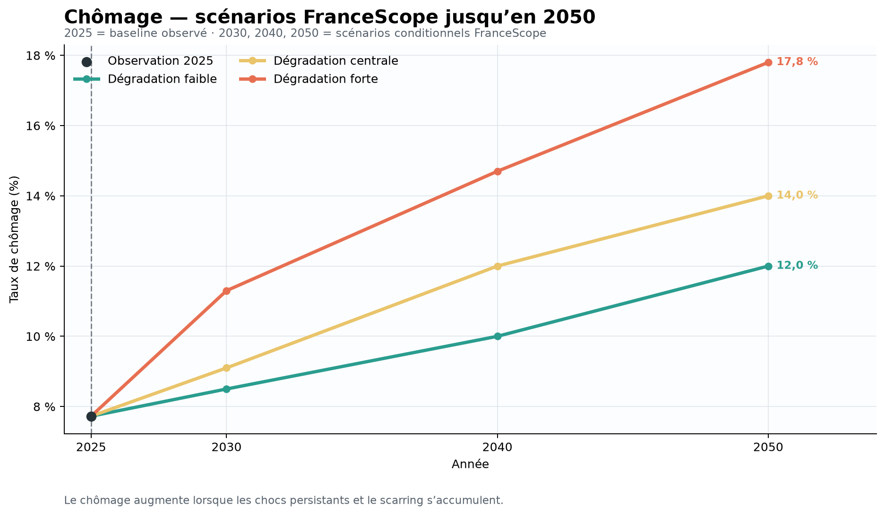
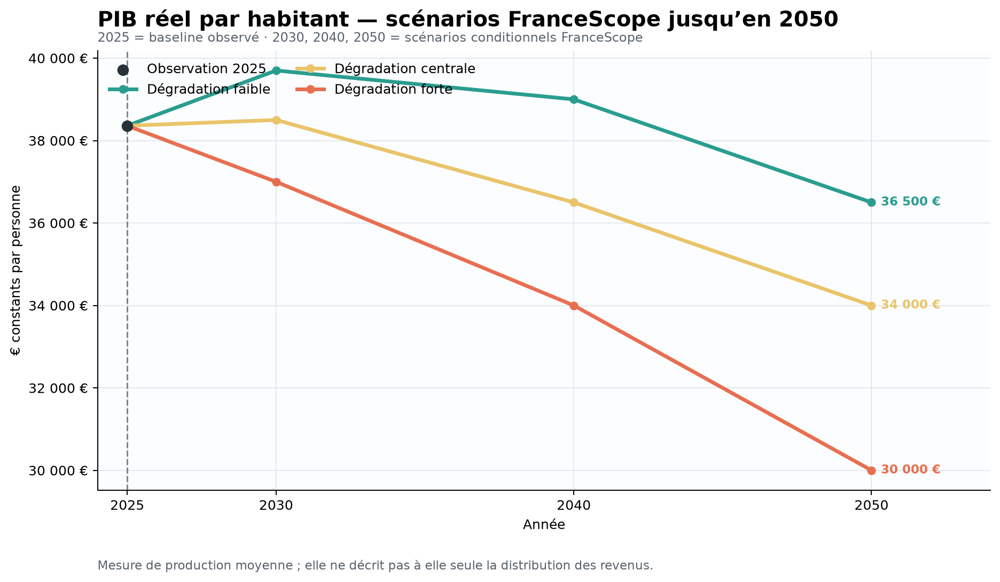
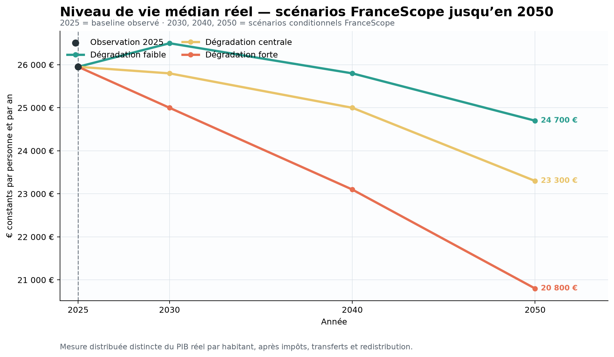

# FranceScope V8 — Rapport technique

## Résumé technique

FranceScope V8 est un cadre de scénarios macroéconomiques de long terme pour
la France. Il ne prétend pas produire une prophétie ponctuelle ni une
prévision institutionnelle officielle. Il examine ce que pourraient devenir
trois résultats économiques sous trois trajectoires conditionnelles de
détérioration structurelle jusqu'en 2050.

Les trois cibles numériques finales sont :

1. le taux de chômage ;
2. le PIB réel par habitant ;
3. le niveau de vie médian réel.

Les trois scénarios sont :

- dégradation faible / *least-bad* ;
- dégradation centrale ;
- dégradation forte.

Le baseline formel est 2025 :

- chômage : **7,725 %** ;
- PIB réel par habitant : **38 360 €** ;
- niveau de vie médian réel : **25 952,51 €**.

| Indicateur | 2025 | Faible 2050 | Centrale 2050 | Forte 2050 |
|---|---:|---:|---:|---:|
| Chômage | 7,725 % | 12,0 % | 14,0 % | 17,8 % |
| PIB réel par habitant | 38 360 € | 36 500 € | 34 000 € | 30 000 € |
| Niveau de vie médian réel | 25 952,51 € | 24 700 € | 23 300 € | 20 800 € |

Une couche institutionnelle accompagne ces scénarios. Elle conserve les
prévisions directes à court terme, la projection structurelle de chômage de la
Commission européenne et les lacunes de comparaison pour les niveaux de PIB
par habitant et de niveau de vie médian. Elle ne constitue pas un quatrième
scénario et ne fabrique pas de niveaux institutionnels absents.

La philosophie générale est de réduire la surface de prévision numérique,
distinguer les mécanismes des résultats, contrôler la cohérence entre cibles et
préserver la provenance des sources. V8 est donc plus simple que les
architectures historiques V3/V7, mais plus facile à vérifier et à défendre.

## 1. Définition du problème

La question de départ est :

> À quoi pourraient ressembler les résultats économiques de long terme de la
> France jusqu'en 2050 sous différentes trajectoires de détérioration
> structurelle ?

FranceScope n'est pas :

- une prévision ponctuelle certaine ;
- un modèle DSGE ;
- une prévision officielle d'une institution ;
- un modèle structurel complet de chaque variable macroéconomique ;
- une promesse de prédire précisément 2050.

FranceScope est :

- un cadre de scénarios conditionnels ;
- informé par les données et les sources institutionnelles ;
- contraint par des analogues historiques ;
- comparé à des références institutionnelles ;
- explicite sur ses incertitudes et ses absences de données.

Les valeurs finales sont des points de scénario. Elles répondent à la question
« que devient une trajectoire cohérente si certaines pressions persistent et se
combinent ? », et non à la question « quelle sera exactement la valeur
observée ? ».

## 2. Pourquoi seulement trois cibles

Les architectures historiques ont étudié un ensemble beaucoup plus large de
variables : dette, déficit, investissement, démographie, productivité, énergie,
climat, commerce, inflation, crédit, emploi et risques. Ces variables restent
importantes pour le raisonnement causal, mais les prévoir toutes séparément
multiplie les hypothèses et les possibilités de double comptage.

V8 distingue donc :

- la surface de sortie numérique ;
- les moteurs causaux et les éléments de preuve.

Le chômage mesure l'accès à l'emploi et la sécurité économique. Le PIB réel par
habitant mesure la capacité productive moyenne. Le niveau de vie médian réel
représente davantage la situation matérielle de la personne médiane après
salaires, impôts, transferts et redistribution.

Cette triade couvre emploi, production et niveau de vie distribué sans écraser
artificiellement les dimensions dans un agrégat. L'ancien Index composite a été
retiré : ses poids et sa normalisation ajoutaient une abstraction normative,
mais pas une information indépendante suffisante.

Les variables intermédiaires ne sont donc pas ignorées. Elles servent à :

- construire les scénarios ;
- justifier les directions ;
- organiser les risques ;
- tester la plausibilité ;
- expliquer les divergences.

Elles ne sont pas présentées comme des trajectoires finales indépendantes.

## 3. Définitions des cibles

### 3.1 Chômage

| Élément | Définition |
|---|---|
| Nom | `unemployment_rate` |
| Géographie | France |
| Unité | Pourcentage |
| Statut | Observation historique ou scénario conditionnel |
| Construction historique | Moyenne annuelle des taux trimestriels harmonisés lorsque disponible |
| Interprétation | Accès à l'emploi, sécurité économique et insertion sur le marché du travail |

La référence institutionnelle européenne à long terme porte sur les personnes
âgées de 20 à 64 ans. Elle est utile mais n'est pas silencieusement traitée
comme identique à chaque définition FranceScope.

### 3.2 PIB réel par habitant

| Élément | Définition |
|---|---|
| Nom | `real_gdp_per_capita` |
| Géographie | France |
| Unité | EUR/personne, prix chaînés 2020 |
| Statut | Observation historique ou scénario conditionnel |
| Source historique principale | Eurostat / série canonique du projet |
| Interprétation | Capacité productive et richesse moyenne produite par personne |

Le PIB total et le PIB par habitant ne sont pas interchangeables. Les
prévisions institutionnelles de croissance du PIB agrégé ne sont donc pas
converties silencieusement en niveaux de PIB par habitant.

### 3.3 Niveau de vie médian réel

| Élément | Définition |
|---|---|
| Nom | `real_median_living_standard` |
| Géographie | France |
| Unité | EUR/personne/an, prix constants |
| Concept | Niveau de vie médian, revenu disponible équivalisé compatible avec l'approche INSEE |
| Source historique principale | INSEE / série canonique compatible |
| Interprétation | Résultat matériel de la personne ou du ménage médian après redistribution |

Cette cible ne mesure pas une moyenne macroéconomique. Elle permet d'examiner
la transmission de la croissance, du chômage, des prix, des impôts et des
transferts vers la distribution.

## 4. Baseline 2025 et données historiques

2025 est le baseline formel parce que les trois cibles disposent d'un ancrage
canonique cohérent dans la couche finale :

- chômage : 7,725 % ;
- PIB réel par habitant : 38 360 € ;
- niveau de vie médian réel : 25 952,514017 € dans le fichier source.

Le chômage observé au deuxième trimestre 2026, à 8,3 %, est une information
contextuelle utilisée pour tester la transition vers 2030. Il ne remplace pas
le baseline annuel 2025.

Le fichier
[final_historical_targets.csv](../data/final/final_historical_targets.csv)
conserve les points historiques disponibles pour les trois cibles. Les années
présentes comprennent notamment 2000, 2005, 2010, 2015, 2019, 2022 et 2025,
avec des couvertures qui ne sont pas identiques selon les variables.

Ces données servent à :

- vérifier les unités et les définitions ;
- situer la vitesse de détérioration ;
- fournir des analogues historiques ;
- contrôler la plausibilité des combinaisons ;
- éviter de présenter un bridge ou une extrapolation comme une observation.

Les historiques ne doivent pas être lus comme une série parfaitement homogène
sur toute la période : les sources, les vintages et les définitions peuvent
différer. Les métadonnées du fichier signalent les observations indisponibles,
les sources et le statut de chaque ligne.

## 5. Sources institutionnelles

La couche institutionnelle a examiné et documenté :

- l'INSEE ;
- la Banque de France ;
- la Commission européenne ;
- Eurostat ;
- l'OCDE ;
- le FMI.

Les sources ne contribuent pas toutes de la même manière. Une série peut être
utilisée numériquement, servir de contexte, documenter une méthode ou être
écartée pour incompatibilité d'horizon ou de définition.

La méthodologie complète, le registre des sources et les distinctions de statut
sont documentés dans
[institutional_benchmark_methodology.md](institutional_benchmark_methodology.md).

### Taxonomie institutionnelle

| Classification | Signification |
|---|---|
| `OBSERVED` | Valeur historique observée |
| `DIRECT_FORECAST` | Prévision publiée directement pour un horizon donné |
| `LONG_RUN_PROJECTION` | Projection structurelle conditionnelle |
| `STRUCTURAL_ASSUMPTION` | Hypothèse de mécanisme ou de scénario |
| `DERIVED_PROXY` | Transformation secondaire, non publiée comme forecast direct |

Une prévision Banque de France de court terme n'est pas un proxy ; une
projection CE d'Ageing Report n'est pas un consensus ; un jalon de croissance
n'est pas automatiquement un niveau.

## 6. Benchmark institutionnel de court et long terme

### Court terme

Le terme consensus est réservé aux cas où au moins deux valeurs comparables
existent pour la même variable et la même année. Les statistiques disponibles
sont :

| Référence | Valeur |
|---|---:|
| Chômage 2026, médiane de 2 institutions | 8,2 % |
| Chômage 2027, médiane de 2 institutions | 8,4 % |
| Chômage 2028, Banque de France directe | 7,8 % |
| Croissance PIB réel agrégé 2026, médiane de 4 institutions | 0,85 % |
| Croissance PIB réel agrégé 2027, médiane de 3 institutions | 1,0 % |

Les deux dernières lignes concernent la croissance du PIB agrégé et non un
niveau de PIB réel par habitant.

### Long terme

La Commission européenne fournit une référence structurelle de chômage
20–64 ans :

| Année | Valeur | Statut |
|---|---:|---|
| 2030 | 7,1 % | `LONG_RUN_PROJECTION` |
| 2040 | 6,7 % | `LONG_RUN_PROJECTION` |
| 2050 | 6,3 % | `LONG_RUN_PROJECTION` |

Il ne s'agit ni d'un consensus multi-institutions ni d'une définition
silencieusement identique au chômage FranceScope.

Pour le PIB réel par habitant, des jalons de croissance institutionnels sont
conservés, mais aucun niveau EUR/personne comparable n'est inventé. Pour le
niveau de vie médian réel, le benchmark institutionnel long terme reste `NA`
après l'ancrage observé de 2025.

## 7. Thèse structurelle

Les scénarios considèrent qualitativement un ensemble de forces structurelles :

- vieillissement ;
- pression budgétaire et charge de la dette ;
- sous-investissement ;
- faiblesse de la productivité ;
- perte de compétitivité et désindustrialisation ;
- énergie et climat ;
- géopolitique et démondialisation ;
- logement et crédit ;
- inadéquation du marché du travail et hystérèse ;
- pression sur la protection sociale et la santé ;
- contraintes politiques ;
- confiance ;
- crises et scarring ;
- interactions non linéaires.

Des facteurs positifs peuvent compenser partiellement ces pressions :

- IA et automatisation ;
- technologie ;
- énergie nucléaire ;
- réformes ;
- investissement vert ;
- soutien européen.

Ces éléments sont des moteurs de scénario et des hypothèses qualitatives. Ils
ne sont pas convertis en séries numériques finales séparées.

## 8. Taxonomie des risques

La recherche de risques est séparée de la sélection directe des trois cibles.
Les catégories principales sont :

1. récession macroéconomique mondiale ;
2. stress souverain et budgétaire français ;
3. crise bancaire, financière ou de refinancement ;
4. choc énergétique et géopolitique ;
5. choc climatique ou alimentaire ;
6. crise politique ou institutionnelle domestique ;
7. fragmentation commerciale et démondialisation ;
8. stress immobilier et du crédit.

Les probabilités de risque ont été examinées sur des horizons de 2, 5, 10 et
25 ans. Elles représentent la probabilité d'au moins un événement répondant à
un critère donné, et non une probabilité que tous les événements se réalisent
indépendamment.

Les événements corrélés sont organisés en clusters. Une crise géopolitique
pouvant transmettre un choc d'énergie et de commerce ne doit pas être comptée
comme trois crises indépendantes. Les probabilités informent donc la
construction des scénarios, mais ne produisent pas mécaniquement des dizaines
de prévisions intermédiaires.

## 9. Architecture des scénarios

Les trois scénarios partagent un socle de détérioration structurelle. Ils
diffèrent par le timing des crises, leur sévérité, leur durée, la qualité de la
récupération, l'hystérèse et les offsets positifs.

### Dégradation faible / least-bad

La détérioration structurelle persiste, mais les chocs sont plus tardifs ou
mieux contenus. La récupération est plus forte, le scarring plus faible et les
offsets technologiques, énergétiques ou institutionnels plus utiles.

Ce scénario n'est pas la prospérité. *Least-bad* signifie le moins défavorable
relativement aux deux autres.

### Dégradation centrale

Les faiblesses structurelles persistent. Des chocs matériels sont plausibles,
la récupération est partielle et le scarring moyen. La trajectoire n'est pas
une moyenne mécanique des deux autres.

### Dégradation forte

Des chocs précoces ou composés se combinent à une reprise faible, une forte
hystérèse, une perte de capital, des faillites et un scarring élevé. Les offsets
positifs existent mais ne suffisent pas à inverser les pressions cumulées.

## 10. Récupération et scarring

Le scarring désigne les pertes persistantes après un choc : capital détruit,
compétences perdues, entreprises disparues, dette accrue, productivité réduite
ou retour incomplet vers l'emploi.

Une détérioration du PIB par habitant peut donc se poursuivre alors que le
chômage ralentit, par exemple si la population active vieillit, si la
productivité baisse ou si le capital par travailleur se dégrade. Inversement,
une protection partielle du niveau de vie médian peut être cohérente avec les
transferts et services publics, mais elle reste limitée par les salaires, la
fiscalité et la capacité budgétaire.

## 11. Philosophie de calibration

Les cibles finales ne sont pas produites par une équation macroéconomique
unique. Leur calibration combine :

- les observations historiques ;
- les références institutionnelles ;
- les analogues internationaux ;
- la logique structurelle des scénarios ;
- le timing des chocs ;
- la qualité de la récupération ;
- le scarring ;
- les évaluations temporelles et cross-variable.

Les valeurs FranceScope sont donc des **estimations ponctuelles de scénario**,
et non des forecasts dérivés des institutions.

### Calibration du chômage

| Scénario | 2030 | 2040 | 2050 |
|---|---:|---:|---:|
| Faible | 8,5 % | 10,0 % | 12,0 % |
| Centrale | 9,1 % | 12,0 % | 14,0 % |
| Forte | 11,3 % | 14,7 % | 17,8 % |

Les points 2030 tiennent compte du baseline 2025 et de l'ancrage contextuel
2026 Q2. Le scénario fort est plus front-loaded ; les scénarios faible et
central laissent davantage de détérioration se matérialiser ensuite par
scarring.

### Calibration du PIB réel par habitant

| Scénario | 2030 | 2040 | 2050 |
|---|---:|---:|---:|
| Faible | 39 700 € | 39 000 € | 36 500 € |
| Centrale | 38 500 € | 36 500 € | 34 000 € |
| Forte | 37 000 € | 34 000 € | 30 000 € |

Le scénario faible conserve une résilience initiale avant une détérioration
plus visible. Les scénarios central et fort intègrent davantage de dommages
cumulés au capital et à la productivité. Le PIB par habitant n'est pas
contraint à évoluer un pour un avec le chômage.

### Calibration du niveau de vie médian réel

| Scénario | 2030 | 2040 | 2050 |
|---|---:|---:|---:|
| Faible | 26 500 € | 25 800 € | 24 700 € |
| Centrale | 25 800 € | 25 000 € | 23 300 € |
| Forte | 25 000 € | 23 100 € | 20 800 € |

La calibration tient compte de la redistribution, des stabilisateurs sociaux et
de la protection partielle du revenu médian. Elle tient aussi compte de la
contrainte progressive exercée par le chômage, les salaires, l'inflation, le
logement, l'énergie et les finances publiques.

Une revue antérieure avait laissé une protection relative trop élevée dans le
scénario fort. Les diagnostics du ratio médian/PIB ont conduit à réduire cette
protection sans supprimer le rôle des stabilisateurs sociaux.

## 12. Cohérence temporelle

Les trois blocs temporels sont :

- 2025–2030 ;
- 2030–2040 ;
- 2040–2050.

L'interprétation finale est :

| Scénario | 2025–2030 | 2030–2040 | 2040–2050 |
|---|---|---|---|
| Faible | Détérioration initiale modérée | Détérioration persistante | Scarring tardif plus marqué |
| Centrale | Stagnation proche terme | Détérioration plus forte dans les années 2030 | Scarring persistant |
| Forte | Crise composée précoce | Crise persistante | Scarring profond |

Les pentes de chômage sont examinées en points par an ; les trajectoires de PIB
et de niveau de vie peuvent être comparées par croissance annualisée. Les
valeurs ne sont gelées qu'après contrôle des transitions et des phases.

## 13. Cohérence cross-variable

Les évaluations portent sur :

- chômage contre PIB par habitant ;
- chômage contre niveau de vie médian ;
- PIB par habitant contre niveau de vie ;
- ratio niveau de vie médian / PIB par habitant ;
- écart entre scénarios et élargissement de l'incertitude.

Aucune élasticité rigide n'est imposée. L'objectif est de détecter une
contradiction, pas de forcer les séries à respecter une formule unique.

Les blocs finaux ont été classés `STRONG` ou `ACCEPTABLE`. Les états `WEAK` ou
`INCONSISTENT` non résolus ne sont pas acceptables pour un bloc gelé.

La méthodologie complète est détaillée dans
[evaluation_framework.md](evaluation_framework.md).

## 14. Analogues historiques et internationaux

Les analogues français comprennent :

- le chômage persistant du début des années 1990 ;
- la crise financière mondiale ;
- la faiblesse de la zone euro ;
- la COVID ;
- la stagnation récente.

Les analogues internationaux comprennent l'Espagne, la Grèce, le Portugal,
l'Italie et le Japon. Ils servent de contraintes de plausibilité pour les
combinaisons de chômage, de production et de niveau de vie. Ils ne sont pas
transférés mécaniquement comme des templates de prévision.

## 15. Résultats finaux complets

| Variable | 2025 | Faible 2030 | Faible 2040 | Faible 2050 | Centrale 2030 | Centrale 2040 | Centrale 2050 | Forte 2030 | Forte 2040 | Forte 2050 |
|---|---:|---:|---:|---:|---:|---:|---:|---:|---:|---:|
| Chômage | 7,725 % | 8,5 % | 10,0 % | 12,0 % | 9,1 % | 12,0 % | 14,0 % | 11,3 % | 14,7 % | 17,8 % |
| PIB réel par habitant | 38 360 € | 39 700 € | 39 000 € | 36 500 € | 38 500 € | 36 500 € | 34 000 € | 37 000 € | 34 000 € | 30 000 € |
| Niveau de vie médian réel | 25 952,51 € | 26 500 € | 25 800 € | 24 700 € | 25 800 € | 25 000 € | 23 300 € | 25 000 € | 23 100 € | 20 800 € |

### Variation entre 2025 et 2050

| Scénario | Chômage | PIB réel par habitant | Niveau de vie médian réel |
|---|---:|---:|---:|
| Faible | +4,275 points | -1 860 € (-4,85 %) | -1 252,51 € (-4,82 %) |
| Centrale | +6,275 points | -4 360 € (-11,37 %) | -2 652,51 € (-10,22 %) |
| Forte | +10,075 points | -8 360 € (-21,79 %) | -5 152,51 € (-19,85 %) |

Ces variations décrivent les scénarios par rapport au baseline ; elles ne
constituent pas une distribution de probabilité ou un intervalle de confiance.

## 16. Visuels

### Trajectoire du chômage

### PIB réel par habitant

### Niveau de vie médian réel

### Chômage : FranceScope et référence institutionnelle

### Tableau de comparaison 2050

## 17. Structure des données et artefacts

### Données finales

[`data/final/`](../data/final/) contient :

- `final_three_target_forecasts.csv` : valeurs finales, scénarios, unités,
  fourchettes et confiance ;
- `final_historical_targets.csv` : ancrages historiques des trois cibles ;
- `final_scenario_definitions.csv` : définitions narratives des scénarios ;
- `final_institutional_comparison.csv` : comparaison finale synthétique.

### Données institutionnelles

[`data/institutional/`](../data/institutional/) contient le registre, les
explications, le consensus de court terme, les références long terme et la
comparaison FranceScope–institutions.

### Sorties

[`outputs/`](../outputs/) contient les tableaux de prévision, les comparaisons
institutionnelles et les graphiques propres à la présentation finale.

Les versions historiques et les artefacts de recherche restent séparés de cette
couche publique.

## 18. Reproductibilité et contrôle des changements

La reproductibilité repose sur :

- des scripts versionnés ;
- des artefacts de recherche conservés ;
- des copies finales nommées clairement ;
- des valeurs gelées ;
- des manifests de validation ;
- l'absence de transformations silencieuses ;
- une séparation entre sources, sorties et archives.

Les copies publiques ne remplacent pas les fichiers de recherche internes :
elles évitent de casser les chemins utilisés par les scripts tout en offrant
une surface lisible aux lecteurs.

Le projet ne revendique pas une reproductibilité parfaite de chaque chiffre à
partir d'un environnement vide : certains inputs historiques ou documents
externes peuvent ne plus être récupérables exactement dans leur vintage
d'origine. Le rapport revendique plutôt une traçabilité explicite, une
validation des valeurs finales et une séparation claire des statuts.

## 19. Limitations et limites

### Incertitude de long terme

L'incertitude augmente fortement à l'approche de 2050. Les points sont des
estimations conditionnelles, pas des certitudes ni des quantiles statistiques.

### Benchmark institutionnel incomplet

Il n'existe pas de benchmark institutionnel direct et comparable pour les trois
cibles à l'horizon 2050. Le chômage dispose d'une projection CE ; les niveaux
de PIB par habitant et de niveau de vie médian ne disposent pas de références
institutionnelles équivalentes.

### Probabilités et jugement

Les probabilités de risque combinent des sources et du jugement de synthèse.
Elles ne constituent pas une distribution statistique complète des résultats
finaux.

### Pas de backtest 2050

Il n'est pas possible de réaliser aujourd'hui un backtest de valeurs 2050. Les
contrôles sont donc principalement des contrôles de cohérence, de plausibilité
et de provenance.

### Variables intermédiaires

Les mécanismes intermédiaires ne sont pas des prévisions numériques finales.
Cette réduction renforce la défendabilité, mais limite la prétention descriptive
du modèle.

### Analogues imparfaits

Les épisodes historiques français et internationaux ne sont jamais identiques.
Ils contraignent la plausibilité sans fournir une loi de projection.

### Évaluations de cohérence

Les tests cross-variable vérifient que les scénarios racontent une histoire
compatible. Ils ne démontrent pas que cette histoire est la trajectoire qui se
réalisera.

### Hypothèses fortes

Les trajectoires de chômage, de crises et de scarring sont fortes, notamment
dans le scénario de dégradation élevée. Les dynamiques politiques,
institutionnelles et de confiance restent intrinsèquement incertaines.

### Stabilisateurs sociaux

La protection partielle du niveau de vie médian par la redistribution, les
transferts et les services publics est plausible, mais sa durée dépend de la
capacité fiscale, des salaires, des prix, du logement et de l'emploi.

### Définitions institutionnelles

Les références utilisent des périmètres d'âge, des concepts et des horizons
différents. La comparaison est donc informative et documentée, mais pas
parfaitement commensurable.

## 20. Conclusion

FranceScope V8 est un framework final à trois cibles, construit à partir d'une
architecture historique beaucoup plus large. Il est plus simple que V7 parce
qu'il ne transforme pas chaque mécanisme causal en forecast numérique. Il est
plus défendable parce qu'il sépare les scénarios, les sources, les horizons,
les évaluations et les données manquantes.

Sa contribution principale n'est pas de promettre une valeur certaine pour
2050. Elle est de rendre explicites :

- les hypothèses structurelles ;
- les différences entre scénarios ;
- les limites des références institutionnelles ;
- les contrôles de cohérence ;
- les décisions de simplification ;
- les responsabilités humaines dans le pilotage du workflow LLM.

> **FranceScope ne cherche pas à rendre 2050 certain ; il cherche à rendre les hypothèses, les divergences et les mécanismes de scénario explicites et auditables.**

## Annexe A — Définitions synthétiques

| Cible | Sens |
|---|---|
| Chômage | Emploi et sécurité économique |
| PIB réel par habitant | Production et capacité productive moyenne |
| Niveau de vie médian réel | Résultat matériel distribué après redistribution |

## Annexe B — Labels de scénarios

| Code conceptuel | Libellé public | Sens |
|---|---|---|
| Optimistic | Dégradation faible / least-bad | Moins défavorable, pas prospérité |
| Central | Dégradation centrale | Pressions persistantes et récupération partielle |
| Pessimistic | Dégradation forte | Chocs plus précoces, scarring élevé, reprise faible |

## Annexe C — Taxonomie institutionnelle

`OBSERVED`, `DIRECT_FORECAST`, `LONG_RUN_PROJECTION`,
`STRUCTURAL_ASSUMPTION`, `DERIVED_PROXY`.

## Annexe D — États d'acceptation

- `STRONG` : cohérence clairement établie ;
- `ACCEPTABLE` : défendable avec un mécanisme explicite ;
- `WEAK` : nécessite une revue ;
- `INCONSISTENT` : ne peut pas rester gelé.

## Annexe E — Fichiers finaux principaux

- [prévisions finales](../data/final/final_three_target_forecasts.csv) ;
- [cibles historiques](../data/final/final_historical_targets.csv) ;
- [références institutionnelles](../data/institutional/institutional_long_run_reference.csv) ;
- [sorties de prévision](../outputs/forecasts/) ;
- [comparaisons](../outputs/comparisons/).

## Annexe F — Documentation connexe

- [README recruteur](../README.md) ;
- [évolution du projet](project_evolution.md) ;
- [workflow LLM fiable](reliable_llm_workflows.md) ;
- [cadre d'évaluation](evaluation_framework.md) ;
- [méthodologie institutionnelle](institutional_benchmark_methodology.md) ;
- [échecs et leçons](failures_and_lessons.md).
